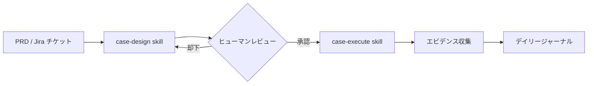
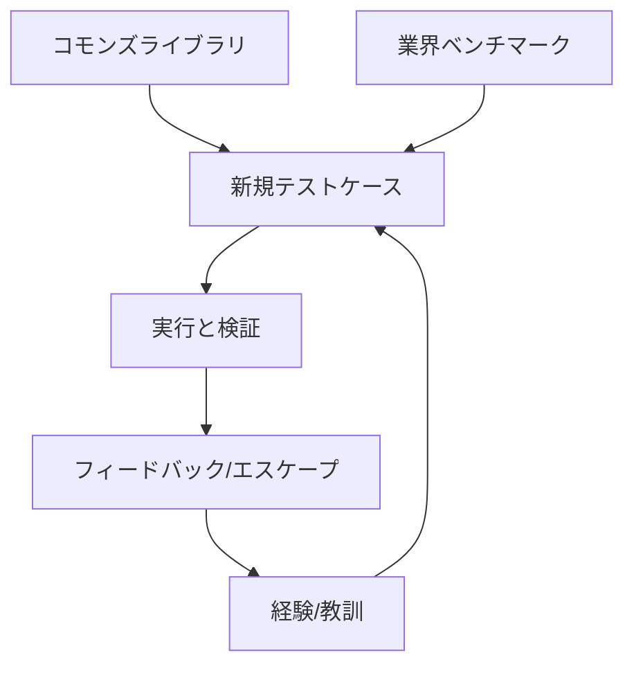

# testcase-os

> [English](README.md) | [简体中文](README.zh-CN.md) | **[日本語](README.ja.md)**

> 汎用テスト知識ベース管理システム。Git ネイティブ、Markdown ファースト、Skill ドリブン。

testcase-os は、QA チームが Git と Markdown を使用してテストケース、知識、経験を管理するのを支援します。独自のデータベースも、ベンダーロックインもありません——既存の開発ツールや AI ワークフローと連携するプレーンテキストファイルのみです。

## コアアドバンテージ

| 機能 | TestRail / Zephyr | TestLink | **testcase-os** |
|:--- |:--- |:--- |:--- |
| **コスト** | 高（SaaS/ライセンス） | メンテナンス（サーバー） | **ゼロ（Git ネイティブ）** |
| **AI 統合** | アドオン/パッシブ | なし | **AI ネイティブ（Skill ドリブン）** |
| **トレーサビリティ** | 基本的なリンク | 手動 | **ソースとベンチマークエビデンス** |
| **コラボレーション** | 内部システム | 内部システム | **Git PR と RBAC** |
| **スケーラビリティ** | ベンダー依存 | プラグインベース | **カスタム Skill/フック/スクリプト** |
| **データ所有権** | 独自データベース | MySQL/Postgres | **プレーンテキスト Markdown** |

## システムワークフロー

### 1. テストケースライフサイクル


### 2. 知識再利用ループ


### 3. マルチ CLI コラボレーションアーキテクチャ
```mermaid
graph TD
    subgraph AI エージェント
        C[Claude] --- G[Gemini]
        CX[Codex] --- K[Kimi]
        CR[Cursor] --- O[OpenCode]
    end
    AI エージェント --> HOK[コンテキストフック]
    HOK --> SI[共有インストラクション]
    SI --> SKI[コア Skill]
    SKI --> GIT[Git / Markdown ストレージ]
```

## クイックスタート

### 1. リポジトリのクローン
```bash
git clone https://github.com/your-org/testcase-os.git
cd testcase-os
```

### 2. セットアップの実行
```bash
bash setup.sh
```

### 3. プロジェクトの設定
`_system/config.yaml` を編集して、プロジェクトメタデータと Jira 統合情報を設定します。

## 利用可能な Skill

複雑な CLI フラグは不要、自然言語で AI エージェントと対話できます。

| Skill | インテント/トリガー | 説明 |
|:--- |:--- |:--- |
| **case-design** | "この PRD からテストケースを設計" | 要件を分析し、コモンズをマッチングし、業界をベンチマークし、カードを生成します。 |
| **case-import** | "login.feature からケースをインポート" | Gherkin または Excel 形式を標準 Markdown カードに変換し、サニタイズを行います。 |
| **case-execute** | "TC-USER-001 をステップバイステップで実行" | ステップを案内し、エビデンスをキャプチャし、デイリージャーナルを更新します。 |
| **daily-track** | "今日のテストを要約" | アクティビティとコミットをスキャンし、構造化された日次進捗レポートを生成します。 |
| **search** | "Order モジュールの P0 ケースを検索" | メタデータと全文コンテンツに対してマルチ基準検索を実行します。`category/value` タグフィルタリングをサポート。 |
| **jira-sync** | "PROJ-1234 から PRD をプル" | 要件を同期し、失敗実行からバグを作成し、ステータスを更新します。 |
| **testrail-sync** | "結果を TestRail に同期" | TestRail とテストケースおよび実行結果を同期します。 |

## ディレクトリ構造

```
testcase-os/
├── _agents/
│   ├── skills/                # スタンドアロン AI Skill 定義
│   └── instructions/
│       └── shared.md          # 共有 AI コンテキストと動作
├── _system/
│   ├── identity.md            # チームとプロジェクト技術スタック
│   ├── goals.md               # 品質 OKR と目標
│   ├── active-context.md      # Sprint フォーカスとブロッカー
│   ├── config.yaml            # グローバルシステム設定
│   ├── tag-taxonomy.yaml      # 構造化タグカテゴリ（category/value）
│   └── context-map.yaml       # タグからコンテンツへのマッピングとバジェット制御
├── cases/                     # モジュラーなテストケースカード
│   ├── _index.md              # ケースインベントリと統計
│   └── {module}/
│       ├── _module.md         # モジュール概要
│       └── TC-{MOD}-{NNN}.md  # Markdown TC カード
├── commons/                   # ユニバーサルテストアセット
│   ├── checklists/            # 再利用可能なチェックリスト
│   ├── methodology/           # 標準テストアプローチ
│   └── templates/             # カスタムカードテンプレート
├── knowledge/                 # ビジネスドメイン知識
├── experience/                # インシデントポストモーテムと教訓
├── journal/                   # デイリーアクティビティログ（監査証跡）
└── scripts/                   # 統合とユーティリティスクリプト
```

## テストケースカードフォーマット

標準化されたカードは AI の予測可能性と人間の可読性を確保します：

```yaml
---
id: TC-RPP-001
title: RPP インプレッションログ検証
module: RPP
priority: P0
risk: high
source: prd
source_ref: "PRD-2026-003 Section 4.2"
benchmark_ref: "Google Ads インプレッショントラッキング"
review: pending
status: active
tags: [domain/ad-rpp, stage/regression, technique/api]
author: william
created: 2026-03-09
---

# RPP インプレッションログ検証

## 前提条件
- Staging 環境が有効
- ログテーリングがアクティブ

## テストステップ
| # | ステップ | 入力 | 期待結果 |
|---|---|---|---|
| 1 | キーワード検索 | みかん | 結果ページが読み込まれる |
| 2 | ログを検証 | - | インプレッションログが生成される |

## 業界ベンチマーク
> **Google Ads**: 1 秒間 50% の可視性を要求。
> **ギャップ**: 当社の PRD には可視性閾値の定義が欠如。
```

## タグシステム

testcase-os は `_system/tag-taxonomy.yaml` で定義された構造化 `category/value` タグを使用します：

| カテゴリ | 説明 | 例 |
|:--- |:--- |:--- |
| `domain/` | ビジネスドメイン | `domain/ad-rpp`, `domain/payment` |
| `module/` | 機能モジュール | `module/RPP`, `module/User` |
| `stage/` | テストステージ | `stage/smoke`, `stage/regression` |
| `technique/` | テスト技法 | `technique/api`, `technique/boundary` |
| `risk/` | リスク関心 | `risk/data-loss`, `risk/money` |
| `knowledge/` | 知識タイプ | `knowledge/postmortem`, `knowledge/tech` |

## コンテキスト管理

Skill は `_system/context-map.yaml` を通じてコンテキストの読み込みを自動管理します：

1. **バジェット制御**：Skill 呼び出しごとに最大 10 ファイル、ファイルあたり 50 行
2. **タグベースマッピング**：タグがどのディレクトリを読み込むかを決定（例：`domain/ad-rpp` → `cases/ad-rpp/` + `knowledge/ad-rpp/`）
3. **優先順位**：cases → knowledge → commons → experience
4. **Wikilinks**：Obsidian スタイルの `[[wikilinks]]` でクロスドキュメントのトレーサビリティを実現

## アップグレードパス

1. **パーソナル/小規模チーム**: 標準 Git フローと共有リポジトリ。
2. **チーム規模**: `team.yaml` によるマルチエージェントオーケストレーションと RBAC。
3. **エンタープライズ**: MCP サーバー統合による高性能インデックスとクロスプロジェクトレポート。

## コントリビューション

コモンズライブラリへの追加や Skill の改善については、[CONTRIBUTING.md](CONTRIBUTING.md) をご参照ください。

## ライセンス

MIT ライセンス。
