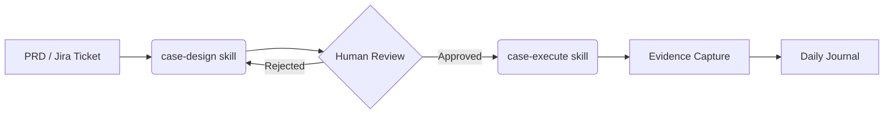
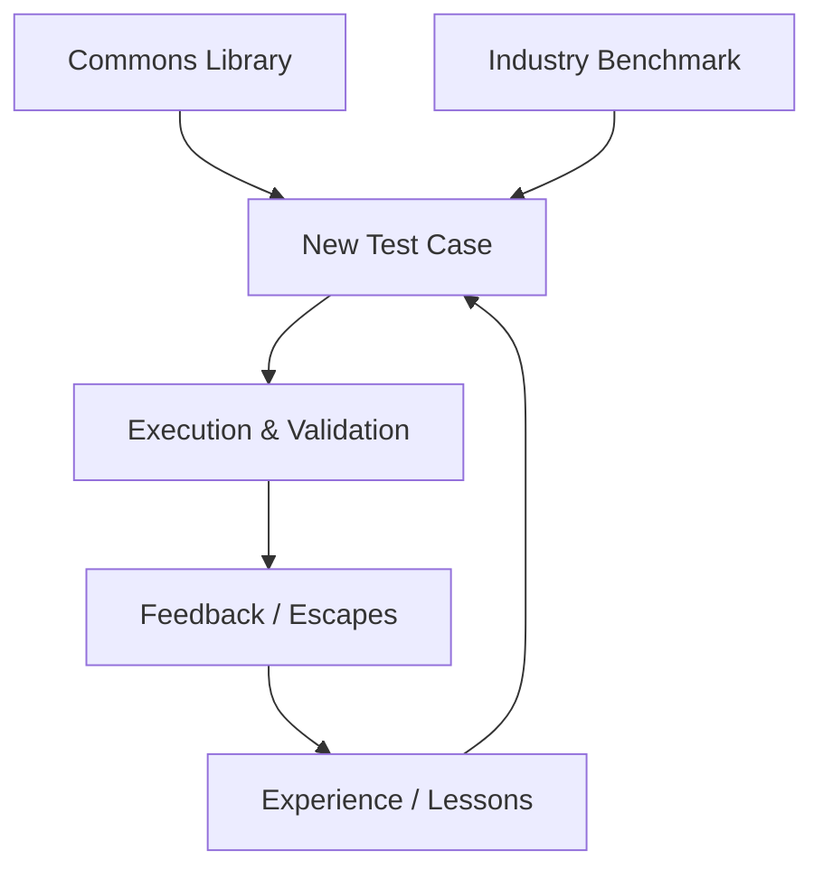

# testcase-os

> **[English](README.md)** | [简体中文](README.zh-CN.md) | [日本語](README.ja.md)

> A universal test knowledge base management system. Git-native, Markdown-first, Skill-driven.

testcase-os helps QA teams manage test cases, knowledge, and experiences using Git and Markdown. No proprietary databases, no vendor lock-in—just plain text files that work with your existing developer tools and AI workflows.

## Core Advantages

| Feature | TestRail / Zephyr | TestLink | **testcase-os** |
|:--- |:--- |:--- |:--- |
| **Cost** | High (SaaS/License) | Maintenance (Server) | **Zero (Git-native)** |
| **AI Integration** | Add-on / Passive | None | **AI-Native (Skill-driven)** |
| **Traceability** | Basic Linking | Manual | **Source & Benchmark Evidence** |
| **Collaboration** | Internal System | Internal System | **Git PR & RBAC** |
| **Scalability** | Vendor Dependent | Plugin Based | **Custom Skills/Hooks/Scripts** |
| **Data Ownership** | Proprietary DB | MySQL/Postgres | **Plain Text Markdown** |

## System Workflows

### 1. Test Case Lifecycle


### 2. Knowledge Reuse Loop


### 3. Multi-CLI Collaborative Architecture
```mermaid
graph TD
    subgraph AI Agents
        C[Claude] --- G[Gemini]
        CX[Codex] --- K[Kimi]
        CR[Cursor] --- O[OpenCode]
    end
    AI Agents --> HOK[Context Hooks]
    HOK --> SI[Shared Instructions]
    SI --> SKI[Core Skills]
    SKI --> GIT[Git / Markdown Storage]
```

## Quick Start

### 1. Clone the Repository
```bash
git clone https://github.com/your-org/testcase-os.git
cd testcase-os
```

### 2. Run Setup
```bash
bash setup.sh
```

### 3. Configure Your Project
Edit `_system/config.yaml` to set your project metadata and Jira integration details.

## Available Skills

Instead of complex CLI flags, interact with your AI agents using natural language.

| Skill | Intent / Trigger | Description |
|:--- |:--- |:--- |
| **case-design** | "Design test cases from this PRD" | Analyzes requirements, matches commons, benchmarks industry, and generates cards. |
| **case-import** | "Import cases from login.feature" | Converts Gherkin or Excel formats into standard Markdown cards with sanitization. |
| **knowledge-import** | "Import knowledge from this URL" | Imports business or technical knowledge from various sources into standardized knowledge cards. |
| **case-execute** | "Execute TC-USER-001 step-by-step" | Guides you through steps, captures evidence, and updates the daily journal. |
| **daily-track** | "Summarize my testing today" | Scans activities and commits to generate a structured daily progress report. |
| **search** | "Find P0 cases in the Order module" | Performs multi-criteria search across metadata and full-text content. Supports `category/value` tag filtering. |
| **jira-sync** | "Pull PRD from PROJ-1234" | Synchronizes requirements, creates bugs from failed runs, and updates status. |
| **testrail-sync** | "Sync results to TestRail" | Synchronizes test cases and execution results with TestRail. |

## Directory Structure

```
testcase-os/
├── _agents/
│   ├── skills/                # Standalone AI skill definitions
│   └── instructions/
│       └── shared.md          # Shared AI context & behavior
├── _system/
│   ├── identity.md            # Team & project technical stack
│   ├── goals.md               # Quality OKRs & goals
│   ├── active-context.md      # Sprint focus & blockers
│   ├── config.yaml            # Global system configuration
│   ├── tag-taxonomy.yaml      # Structured tag categories (category/value)
│   └── context-map.yaml       # Tag-to-content mapping & budget control
├── cases/                     # Modular test case cards
│   ├── _index.md              # Case inventory & stats
│   └── {module}/
│       ├── _module.md         # Module overview
│       └── TC-{MOD}-{NNN}.md  # Markdown TC cards
├── commons/                   # Universal testing assets
│   ├── checklists/            # Reusable checklists
│   ├── methodology/           # Standard testing approaches
│   └── templates/             # Custom card templates
├── knowledge/                 # Business domain knowledge
├── experience/                # Incident post-mortems & lessons
├── journal/                   # Daily activity logs (Audit trail)
└── scripts/                   # Integration & utility scripts
```

## Test Case Card Format

Standardized cards ensure AI predictability and human readability:

```yaml
---
id: TC-RPP-001
title: RPP Impression Log Validation
module: RPP
priority: P0
risk: high
source: prd
source_ref: "PRD-2026-003 Section 4.2"
benchmark_ref: "Google Ads impression tracking"
review: pending
status: active
tags: [domain/ad-rpp, stage/regression, technique/api]
author: william
created: 2026-03-09
---

# RPP Impression Log Validation

## Preconditions
- Staging environment enabled
- Log tailing active

## Test Steps
| # | Step | Input | Expected Result |
|---|---|---|---|
| 1 | Search keyword | みかん | Result page loads |
| 2 | Verify log | - | Impression log generated |

## Industry Benchmark
> **Google Ads**: Requires 50% visibility for 1s.
> **Gap**: Our PRD lacks visibility threshold definition.
```

## Tag System

testcase-os uses structured `category/value` tags defined in `_system/tag-taxonomy.yaml`:

| Category | Description | Examples |
|:--- |:--- |:--- |
| `domain/` | Business domain | `domain/ad-rpp`, `domain/payment` |
| `module/` | Functional module | `module/RPP`, `module/User` |
| `stage/` | Test stage | `stage/smoke`, `stage/regression` |
| `technique/` | Test technique | `technique/api`, `technique/boundary` |
| `risk/` | Risk concern | `risk/data-loss`, `risk/money` |
| `knowledge/` | Knowledge type | `knowledge/postmortem`, `knowledge/tech` |

## Context Management

Skills automatically manage context loading via `_system/context-map.yaml`:

1. **Budget Control**: Max 10 files per skill invocation, 50 lines per file
2. **Tag-based Mapping**: Tags determine which directories to load (e.g., `domain/ad-rpp` → `cases/ad-rpp/` + `knowledge/ad-rpp/`)
3. **Priority Order**: cases → knowledge → commons → experience
4. **Wikilinks**: Obsidian-style `[[wikilinks]]` for cross-document traceability

## Upgrade Path

1. **Personal / Small Team**: Standard Git flow with shared repository.
2. **Team Scale**: Multi-agent orchestration with RBAC via `team.yaml`.
3. **Enterprise**: MCP server integration for high-performance indexing and cross-project reporting.

## Contributing
Please see [CONTRIBUTING.md](CONTRIBUTING.md) for details on adding to the Commons library or improving Skills.

## License
MIT License.
