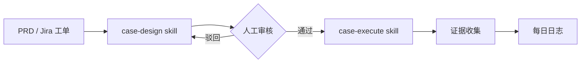
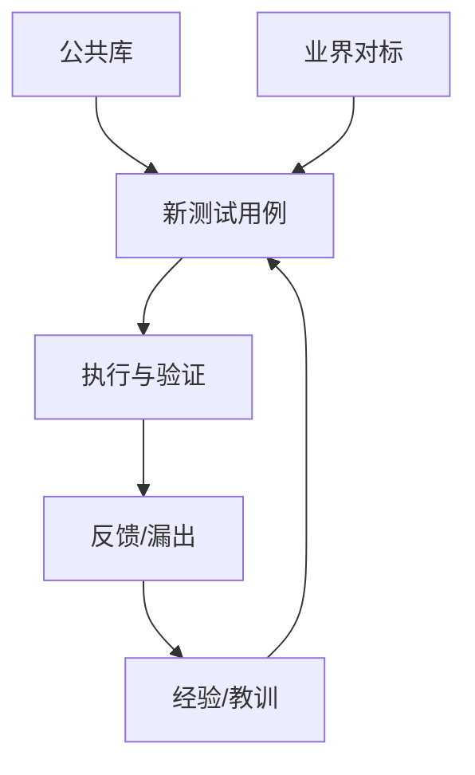
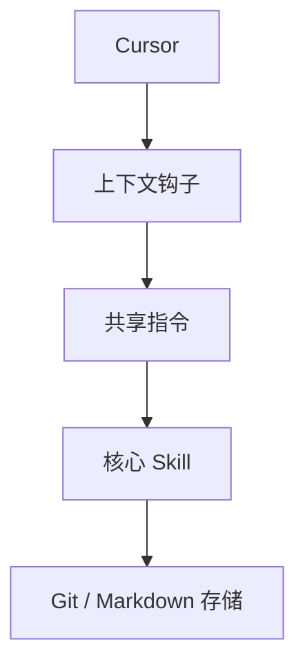

# testcase-os

> [English](README.md) | **[简体中文](README.zh-CN.md)** | [日本語](README.ja.md)

> 通用测试知识库管理系统。Git 原生、Markdown 优先、Skill 驱动。

testcase-os 帮助 QA 团队使用 Git 和 Markdown 管理测试用例、知识和经验。没有专有数据库，没有供应商锁定——只有与你现有开发工具和 AI 工作流完美配合的纯文本文件。

## 核心优势

| 特性 | TestRail / Zephyr | TestLink | **testcase-os** |
|:--- |:--- |:--- |:--- |
| **成本** | 高（SaaS/许可证） | 维护成本（服务器） | **零成本（Git 原生）** |
| **AI 集成** | 附加组件/被动 | 无 | **AI 原生（Skill 驱动）** |
| **可追溯性** | 基础链接 | 手动 | **来源与对标证据** |
| **协作** | 内部系统 | 内部系统 | **Git PR 与 RBAC** |
| **可扩展性** | 依赖供应商 | 基于插件 | **自定义 Skill/钩子/脚本** |
| **数据所有权** | 专有数据库 | MySQL/Postgres | **纯文本 Markdown** |

## 系统工作流

### 1. 测试用例生命周期


### 2. 知识复用闭环


### 3. 架构


## 快速开始

### 1. 克隆仓库
```bash
git clone https://github.com/your-org/testcase-os.git
cd testcase-os
```

### 2. 运行安装脚本
```bash
bash setup.sh
```

### 3. 配置项目
编辑 `_system/config.yaml`，设置项目元数据和 Jira 集成信息。

### 4. 安装配置 Jira CLI（可选）

`jira-sync` skill 依赖 [jira-cli](https://github.com/ankitpokhrel/jira-cli)，安装和配置方法如下：

```bash
# macOS
brew install ankitpokhrel/jira-cli/jira-cli

# 或通过 Go 安装
go install github.com/ankitpokhrel/jira-cli/cmd/jira@latest
```

如果你的 Jira Server 使用了 context path（如 `/jira`），先验证 API 可达：

```bash
curl -s -H "Authorization: Bearer <YOUR_TOKEN>" https://<YOUR_JIRA_HOST>/jira/rest/api/2/myself
```

手动创建配置文件（推荐用于 Jira Server + Bearer 认证）：

```bash
mkdir -p ~/.config/.jira
cat > ~/.config/.jira/.config.yml << 'EOF'
installation: local
server: https://<YOUR_JIRA_HOST>/jira
login: <YOUR_USERNAME>
project: ""
board:
  id: 0
  name: ""
  type: ""
epic:
  name: customfield_10014
  link: customfield_10008
EOF
```

在 shell 配置中设置 API Token：

```bash
echo 'export JIRA_API_TOKEN="<YOUR_TOKEN>"' >> ~/.zshrc
source ~/.zshrc
```

验证连接：

```bash
jira me
```

### 5. 配置 Confluence 集成（可选）

`case-design` skill 可以查询 Confluence 知识库获取相关内容。未配置时自动跳过。

编辑 `_system/config.yaml` 设置 Confluence 信息：

```yaml
confluence:
  base_url: "https://<YOUR_CONFLUENCE_HOST>/confluence"
  space_key: "<YOUR_SPACE_KEY>"
  token_env: "CONFLUENCE_API_TOKEN"
```

在 shell 配置中设置 API Token：

```bash
echo 'export CONFLUENCE_API_TOKEN="<YOUR_TOKEN>"' >> ~/.zshrc
source ~/.zshrc
```

验证连接：

```bash
curl -s -H "Authorization: Bearer $CONFLUENCE_API_TOKEN" \
  "https://<YOUR_CONFLUENCE_HOST>/confluence/rest/api/content/search?cql=space=<YOUR_SPACE_KEY>&limit=1"
```

> 如果 `CONFLUENCE_API_TOKEN` 为空或未设置，skill 会自动跳过 Confluence 查询，不会报错。

## 可用 Skill

无需复杂的 CLI 参数，用自然语言与你的 AI 智能体交互。

| Skill | 意图/触发词 | 说明 |
|:--- |:--- |:--- |
| **case-design** | "从这个 PRD 设计测试用例" | 分析需求、匹配公共库、对标业界、生成卡片。 |
| **case-import** | "从 login.feature 导入用例" | 将 Gherkin 或 Excel 格式转换为标准 Markdown 卡片，支持脱敏。 |
| **knowledge-import** | "从这个 URL 导入知识" | 从多种来源导入业务或技术知识，生成标准化知识卡片。 |
| **case-execute** | "逐步执行 TC-USER-001" | 引导你完成步骤、收集证据、更新每日日志。 |
| **daily-track** | "总结今天的测试工作" | 扫描活动和提交记录，生成结构化的每日进展报告。 |
| **search** | "查找订单模块的 P0 用例" | 基于元数据和全文内容进行多条件搜索。支持 `category/value` 标签过滤。 |
| **jira-sync** | "拉取 PROJ-1234 的 PRD" | 同步需求、从失败执行创建 Bug、更新状态。 |
| **testrail-sync** | "同步结果到 TestRail" | 与 TestRail 同步测试用例和执行结果。 |

## 目录结构

```
testcase-os/
├── _agents/
│   ├── skills/                # 独立的 AI Skill 定义
│   └── instructions/
│       └── shared.md          # 共享 AI 上下文与行为
├── _system/
│   ├── identity.md            # 团队与项目技术栈
│   ├── goals.md               # 质量 OKR 与目标
│   ├── active-context.md      # Sprint 焦点与阻塞项
│   ├── config.yaml            # 全局系统配置
│   ├── tag-taxonomy.yaml      # 结构化标签分类（category/value）
│   └── context-map.yaml       # 标签到内容的映射与预算控制
├── cases/                     # 模块化测试用例卡片
│   ├── _index.md              # 用例清单与统计
│   └── {module}/
│       ├── _module.md         # 模块概览
│       └── TC-{MOD}-{NNN}.md  # Markdown 用例卡片
├── commons/                   # 通用测试资产
│   ├── checklists/            # 可复用检查清单
│   ├── methodology/           # 标准测试方法
│   └── templates/             # 自定义卡片模板
├── knowledge/                 # 业务领域知识
├── experience/                # 事故复盘与经验教训
├── journal/                   # 每日活动日志（审计追踪）
├── scripts/                   # 集成与实用脚本
│   └── sync-cursor-skills.sh  # 同步 Skills 到 Cursor（项目级 + 全局）
└── .cursor/skills/            # 自动生成的 Cursor Skill 发现目录
```

## 测试用例卡片格式

标准化卡片确保 AI 可预测性和人类可读性：

```yaml
---
id: TC-RPP-001
title: RPP 展示日志验证
module: RPP
priority: P0
risk: high
source: prd
source_ref: "PRD-2026-003 Section 4.2"
benchmark_ref: "Google Ads 展示追踪"
review: pending
status: active
tags: [domain/ad-rpp, stage/regression, technique/api]
author: william
created: 2026-03-09
---

# RPP 展示日志验证

## 前置条件
- 启用 Staging 环境
- 开启日志追踪

## 测试步骤
| # | 步骤 | 输入 | 预期结果 |
|---|---|---|---|
| 1 | 搜索关键词 | みかん | 结果页加载 |
| 2 | 验证日志 | - | 生成展示日志 |

## 业界对标
> **Google Ads**: 要求 50% 可见度持续 1 秒。
> **差距**: 我们的 PRD 缺少可见度阈值定义。
```

## 标签体系

testcase-os 使用结构化 `category/value` 标签，定义在 `_system/tag-taxonomy.yaml`：

| 分类 | 说明 | 示例 |
|:--- |:--- |:--- |
| `domain/` | 业务领域 | `domain/ad-rpp`, `domain/payment` |
| `module/` | 功能模块 | `module/RPP`, `module/User` |
| `stage/` | 测试阶段 | `stage/smoke`, `stage/regression` |
| `technique/` | 测试技术 | `technique/api`, `technique/boundary` |
| `risk/` | 风险关注 | `risk/data-loss`, `risk/money` |
| `knowledge/` | 知识类型 | `knowledge/postmortem`, `knowledge/tech` |

## 上下文管理

Skill 通过 `_system/context-map.yaml` 自动管理上下文加载：

1. **预算控制**：每次 skill 调用最多 10 个文件，每文件 50 行
2. **标签映射**：标签决定加载哪些目录（如 `domain/ad-rpp` → `cases/ad-rpp/` + `knowledge/ad-rpp/`）
3. **优先级顺序**：cases → knowledge → commons → experience
4. **Wikilinks**：Obsidian 风格 `[[wikilinks]]` 实现跨文档可追溯

## 升级路径

1. **个人/小团队**: 标准 Git 工作流与共享仓库。
2. **团队规模**: 通过 `team.yaml` 实现多智能体编排与 RBAC。
3. **企业版**: MCP 服务器集成，实现高性能索引与跨项目报表。

## 贡献

请参阅 [CONTRIBUTING.md](CONTRIBUTING.md) 了解如何为公共库贡献内容或改进 Skill。

## 许可证

MIT 许可证。
